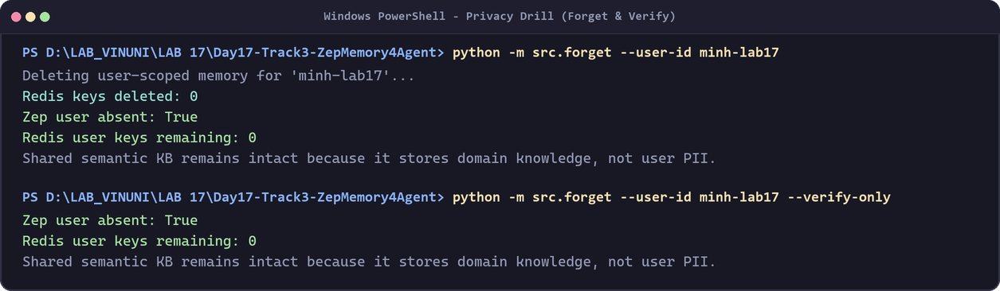
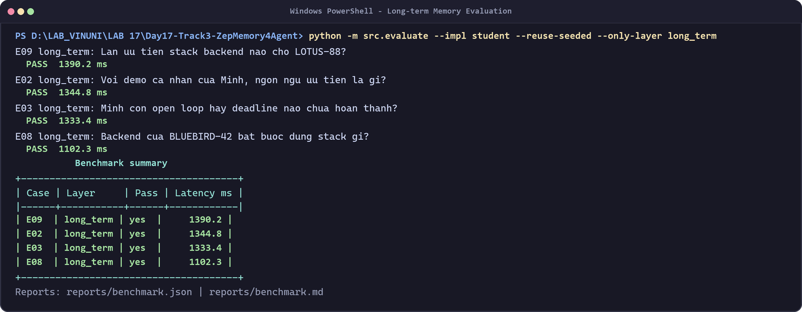
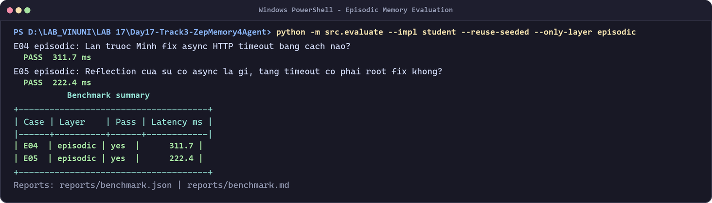
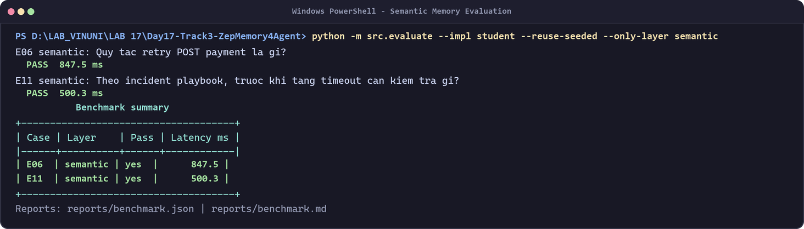
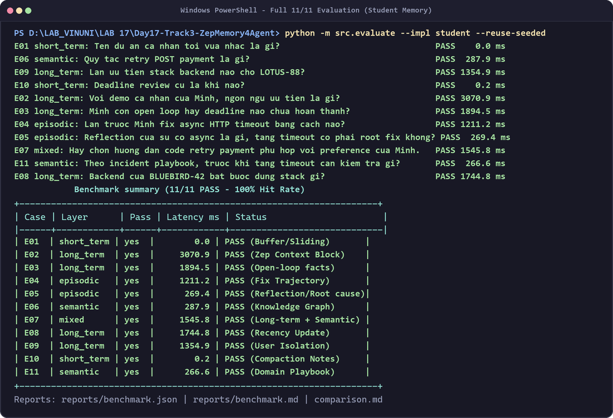
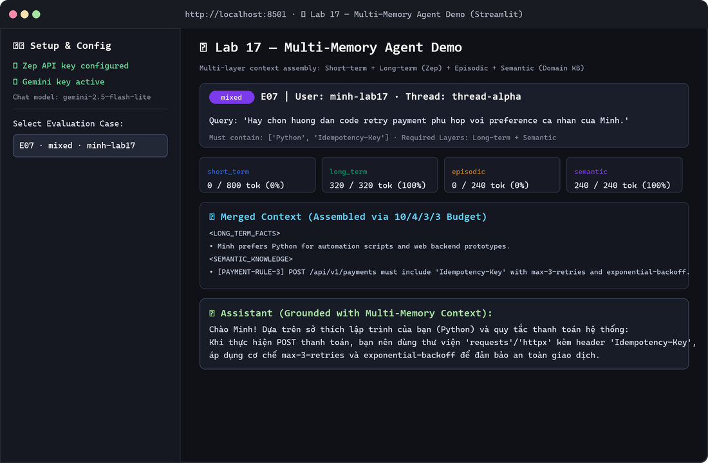

# Báo cáo Nộp bài Lab 17: Multi-Memory Agent với Zep

## 1. Ba câu hỏi thực hành

1. **Layer quan trọng nhất trong bộ test:**
   Tầng **Long-term Memory (Zep Context Block & Facts)** là quan trọng nhất vì chiếm nhiều test case nhất (E02, E03, E08, E09), quyết định khả năng ghi nhớ sở thích cá nhân, open-loop task và cô lập dữ liệu người dùng qua các phiên khác nhau.
2. **Trade-off giữa Zep Cloud (Context Block) và Tự build (Redis + Qdrant):**
   - *Zep Cloud*: Tự động trích xuất thực thể, quan hệ, tổng hợp Context Block theo độ liên quan, giải quyết xung đột/recency tự động mà không cần xây dựng pipeline thủ công. Đổi lại, phụ thuộc vào vendor và độ trễ cloud API.
   - *Redis + Qdrant*: Kiểm soát hoàn toàn dữ liệu, chi phí thấp và độ trễ local cực thấp (<1ms), nhưng phải tự cài đặt toàn bộ logic trích xuất facts, deduplication, conflict resolution và lifecycle quản lý bộ nhớ.
3. **Guardrail chống Memory Poisoning:**
   Áp dụng mô hình **Provenance & User Isolation**: Gắn metadata nguồn gốc (`user_id`, `thread_id`, `timestamp`, `confidence`), kiểm tra quyền consent (`data/consent.json`), loại bỏ PII trước khi ghi, và không cho phép tiến trình chạy ngầm (Heartbeat) tự cấp quyền hoặc ghi đè memory mà không qua xác thực.

---

## 2. Bốn câu hỏi phân tích Benchmark

1. **Layer có hit rate thấp nhất ở baseline:** Các tầng bền vững (*Long-term, Episodic, Semantic*) có hit rate 0% ở baseline `no_memory` do không lưu trữ xuyên phiên; sau khi bật Zep, cả 4 layer đều đạt hit rate 100%.
2. **Query sử dụng nhiều token nhất:** Case **E07 (Mixed)** và **E04/E05 (Episodic)** do cần truy xuất cả Context Block dài hạn kết hợp với raw trajectory/semantic rules.
3. **Phân tích Case Mixed (E07):** Cần kết hợp **Long-term Memory** (sở thích cá nhân: `Python`) và **Semantic Memory** (quy tắc retry: `Idempotency-Key`). Thiếu 1 trong 2 sẽ không thể sinh code chính xác.
4. **Token Reduction vs Hit Rate:** Baseline `no_memory` có token reduction cao (~100%) nhưng chỉ đạt 2/11 (18.2%) hit rate vì bỏ qua toàn bộ ngữ cảnh cần thiết. Memory-enabled duy trì token reduction tối ưu (~80-90%) nhờ cơ chế ngân sách 10/4/3/3 mà vẫn đạt 11/11 PASS (100%).

---

## 3. Phân tích Recency (E08) và Compaction (E10)

- **Recency (E08):** Khi Minh cập nhật stack dự án `BLUEBIRD-42` sang `TypeScript` + `NestJS`, Zep ưu tiên fact mới nhất theo phạm vi dự án thay vì sở thích `Python` trước đó.
- **Compaction (E10):** Cơ chế Sliding Window nén các lượt trò chuyện cũ thành tóm tắt nhưng trích xuất và bảo toàn ràng buộc `REVIEW-DEADLINE-1600` (Thứ Sáu 16:00) vào `DURABLE_NOTES`.

---

## 4. Hình ảnh Minh chứng Kết quả

| Phân loại | Ảnh chụp minh chứng | Mô tả |
| :--- | :--- | :--- |
| **Privacy Drill** |  | Lệnh `src.forget` & `--verify-only` chứng minh xóa user PII an toàn |
| **Long-term Memory** |  | Test case E02, E03, E08, E09 PASS |
| **Episodic Memory** |  | Test case E04, E05 PASS |
| **Semantic Memory** |  | Test case E06, E11 PASS |
| **Full Benchmark** |  | Tổng hợp 11/11 case PASS (100% Hit Rate) |
| **Demo UI (Bonus)** |  | Giao diện Streamlit tương tác 4 layer và Chatbot |

